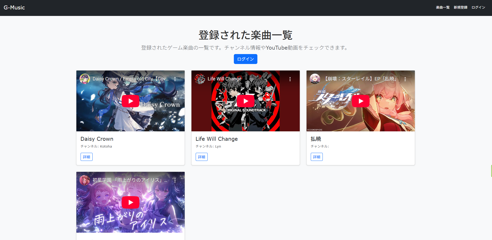
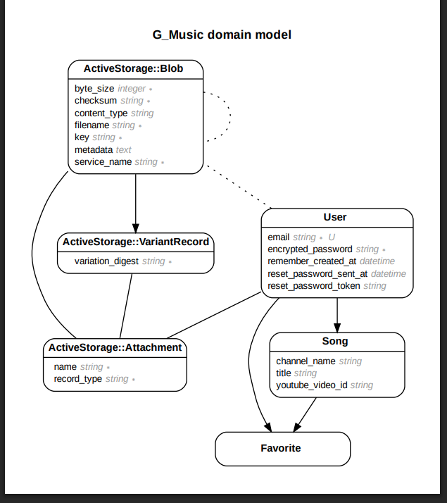

# ゲーム楽曲紹介アプリ

## 1. サービス概要  
ゲームのサウンドトラックを集めて紹介できる、音楽好きのためのWebアプリです。  
ユーザーはYouTube動画を登録し、他の人と共有・視聴することができます。

## 2. サービス画像  

## 3. サービスのURL  
[G-Music](https://calm-forest-43832-8a9790781793.herokuapp.com/)

**ゲストログイン**
- メールアドレス：`test@example.com`
- パスワード：`password`

## 4. サービスの概要  
このアプリは、ゲーム音楽ファンがYouTubeの楽曲を紹介・視聴できるプラットフォームです。  
楽曲の一覧表示、サムネイル付きの再生画面、お気に入り登録などの機能を搭載し、  
ゲーム音楽の共有と発見をサポートします。

## 5. 開発背景  
ゲームのサウンドトラックは作品の魅力の一部ですが、まとまって紹介される場所が少ないと感じていました。  
YouTubeに公式・非公式問わず多くの楽曲が投稿されている一方、  
楽曲名やシリーズで整理された形で閲覧する仕組みが不十分だと感じ、  
「ファンが自ら投稿し、整理できる場所」として本アプリを構想しました。

## 6. 主な機能

- トップページに楽曲一覧を表示（サムネイル・タイトル・チャンネル名）
- 楽曲詳細ページで動画再生が可能（YouTube iframe 埋め込み）
- 楽曲のお気に入り登録／解除機能（ログイン中のユーザーのみ）
- Bootstrap によるシンプルで見やすいUI

## 7. 主な使用技術

### フロントエンド
- HTML / CSS / JavaScript
- Bootstrap（UIフレームワーク）

### バックエンド
- Ruby 3.3.3
- Ruby on Rails 6.1.3.2
- SQLite（開発環境） / PostgreSQL（本番予定）

### インフラ・開発環境
- Git / GitHub（バージョン管理）
- Heroku

## 8. ER図

## 9. 今後の展望

### 🔧 直近の修正予定
- 楽曲検索機能の実装（キーワード・チャンネル名）
- 各ページのレイアウト調整
- レスポンシブ対応

### 🚀 短期的な目標
- 楽曲投稿時のタグ機能追加
- ゲーム名などでフィルタリング
- ユーザーのプロフィールページ作成

### 🌐 中長期的な目標
- コメント・レビュー投稿機能
- YouTube Data APIを利用した動画の詳細情報の取得

---

## 10. 備考
- このアプリではAPIは使用しておらず、YouTube動画の埋め込み（iframe）によって再生を実現しています。
